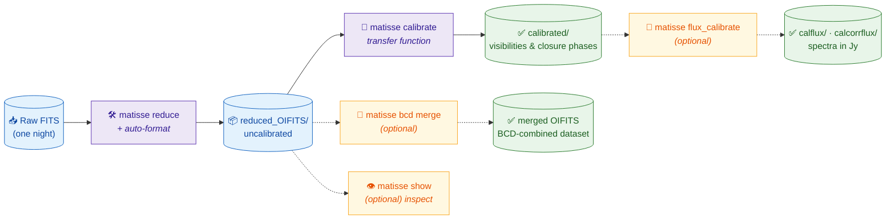
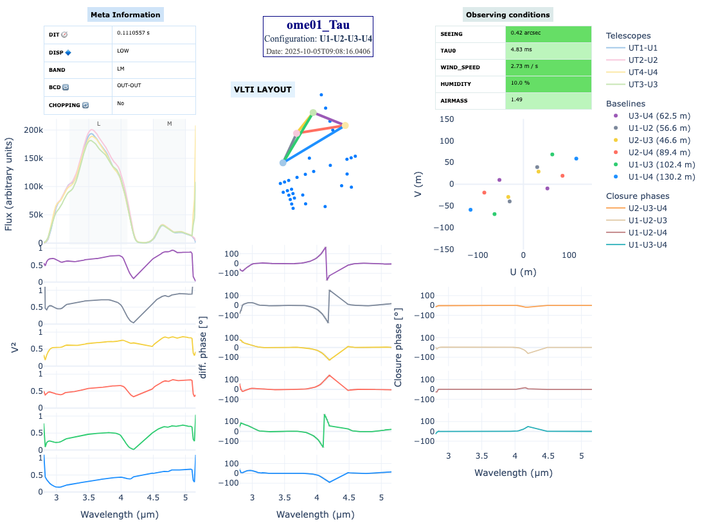

<!-- markdownlint-disable MD033 MD041 -->
<p align="center">
  <a href="https://github.com/Matisse-Consortium/matisse-pipeline">
    
  </a>
</p>

<h1 align="center">MATISSE CLI Tutorial</h1>
<p align="center"><i>From raw data to calibrated OIFITS — a step-by-step guide for newcomers</i></p>

<p align="center">
  
  
  
  
  
</p>
<!-- markdownlint-enable MD033 MD041 -->

---

This tutorial walks you through reducing MATISSE data with the `matisse`
command-line interface (CLI), step by step. It is written for newcomers: you do
**not** need to be an expert in the instrument, in interferometric data
reduction, or in Python tooling to follow it.

## 0. A few words of vocabulary

If you are new to MATISSE or to optical interferometry, here are the terms used
throughout this guide:

| Term | What it means |
| --- | --- |
| **Raw FITS files** | The unprocessed data delivered by the instrument (FITS is the standard astronomy file format). One night of observation is a folder full of these. |
| **OIFITS files** | The *reduced* data products, in the standard Optical Interferometry FITS format. They hold the quantities you actually analyse: visibilities, closure phases, fluxes, etc. |
| **Science target vs calibrator** | You observe your object of interest (the *science target*) **and** a well-known reference star (the *calibrator*) nearby in time and sky position. The calibrator lets you remove the instrument's and atmosphere's signature. |
| **Transfer function** | The combined instrumental + atmospheric response, measured on the calibrator and divided out of the science data during calibration. |
| **Visibility (V²) & closure phase** | The core interferometric observables: how "contrasted" the fringes are (related to source size) and a phase quantity robust to atmospheric noise (related to source asymmetry). |
| **Baseline** | One pair of telescopes. The 4 VLTI telescopes give 6 baselines (and 4 closure-phase triangles). |
| **L/M and N bands** | The two infrared wavelength regions MATISSE records, on two separate detectors. "LM" is the shorter-wavelength band, "N" the longer one. |
| **BCD** (Beam Commuting Device) | An optical component that swaps the VLTI beams. Combining the different BCD positions improves the closure phase and signal-to-noise. |
| **esorex / recipes** | `esorex` is ESO's command-line engine that runs the low-level *recipes* (`mat_*` programs). The `matisse` CLI orchestrates which recipes run, in which order, on which files — so you don't have to. |

---

## 1. Prerequisites

### 1.1 The `matisse` Python package

The CLI ships as a Python package. The project uses
[`uv`](https://github.com/astral-sh/uv), a fast, modern replacement for `pip`
that also manages isolated Python environments (so MATISSE's dependencies don't
clash with anything else on your machine).

In short, you create an isolated environment, activate it, and install the
package into it:

```bash
uv venv --python 3.14 my-matisse-env     # create an isolated environment
source my-matisse-env/bin/activate       # activate it (do this each session)
uv pip install matisse                    # install the CLI inside it
```

Once installed and activated, the `matisse` command is available. Python 3.10+
is required. See the [README installation section](../README.md#-installation-users)
for the full instructions (including how to install `uv` itself).

### 1.2 The ESO pipeline (`esorex` + MATISSE recipes)

The `matisse` CLI does not reduce data on its own: it drives ESO's `esorex`
engine and the MATISSE recipes (`mat_*`). These must be installed separately,
following ESO's instructions. If `esorex` is on your `PATH` and the recipes are
visible to it, you are good to go.

### 1.3 Check your setup

Before reducing anything, run the built-in diagnostic. It verifies that
`esorex` is found, that the MATISSE recipes are visible, and reports the status
of the reference calibration databases:

```bash
matisse doctor
```

If the recipes are not found automatically, point `doctor` at the directory
that contains them:

```bash
matisse doctor --recipe-dir /path/to/esopipes-plugins
```

---

## 2. The big picture

The recommended end-to-end flow is:



> [!NOTE]
> The diagram above renders as a colored flowchart on GitHub. If you are reading
> this in a plain editor, the same steps are described just below. The final
> products are: **visibility-calibrated** OIFITS (`calibrated/`),
> **flux-calibrated spectra in Jy** (`calflux/` / `calcorrflux/`, produced from
> the calibrated data), and a single **BCD-merged dataset** (also obtainable
> during calibration via `--cumul-block`).

1. **`matisse reduce`** — turn raw FITS into uncalibrated OIFITS. Formatting
   (collecting and renaming the OIFITS) now happens **automatically** at the end
   of this step.
2. **`matisse calibrate`** — apply the transfer function using calibrators
   (visibility / closure-phase calibration).
3. *(optional)* **`matisse flux_calibrate`** — spectrophotometric calibration of
   the *spectra* (total or correlated flux).
4. *(optional)* **`matisse bcd ...`** — BCD corrections.
5. *(optional)* **`matisse show`** — visual inspection.

> [!IMPORTANT]
> **For users of older versions:** the pipeline no longer creates `Iter*`
> folders, and there is no `--max-iter` option anymore. A single `matisse reduce`
> run handles everything and produces `reduced/` and `reduced_OIFITS/`.

---

## 3. Step A — Reduce raw files

```bash
matisse reduce -d /data/raw_night -r /data/output -n 4
```

(`-d` = `--data-dir`, `-r` = `--result-dir`, `-n` = `--nbcore`.)

### What it does

- Reads the raw MATISSE FITS files in `--data-dir`.
- Groups them into **reduction blocks** by observing template and detector.
- Runs the right ESO recipes (`esorex`) block by block. It automatically reduces
  the calibration products first (flat field, kappa matrix, shift map, …) and
  then the science files, reusing those calibration products — you don't have to
  manage this ordering yourself.
- Runs blocks in parallel when `--nbcore > 1` (recommended — it is much faster).
- **Formats the results automatically** at the end (collects and renames the
  OIFITS files).

### What you get

Inside your `--result-dir` (current directory by default):

- `reduced/` — intermediate products: one `*.rb/` folder per reduction block,
  containing the recipe logs and reduced FITS. You normally don't touch these.
- `reduced_OIFITS/` — the final, clean OIFITS files, renamed with their metadata
  (template start, target, configuration, band, resolution, BCD mode, chopping).
  **This is the folder you use in the next step.**

If you re-run with the same `--result-dir`, already-processed files are skipped
unless you pass `--overwrite`.

### ⚙️ Reduction options

#### Selecting what to reduce

| Option | Description |
| --- | --- |
| `--resol LOW\|MED\|HIGH\|ALL` | Spectral resolution. Default `ALL` (reduce every resolution found). |
| `--skipL` / `--skipN` | Skip the L/M or the N band entirely. |
| `--tplid` / `--tplstart` | Reduce only a given observing template (by ID or start time). |

#### Quality filtering (recipe 2.4+ only)

Corrections applied to the squared visibilities (VIS2):

| Option | Description |
| --- | --- |
| `--vfactor / --no-vfactor` | Enable/disable the *vfactor* correction (on by default). |
| `--pfactor / --no-pfactor` | Enable/disable the *pfactor* correction (on by default). |
| `--filter-mode vf,pf,jp` | Frame-selection filters to apply: `vf` (vfactor), `pf` (pfactor), `jp` (fringe jump), or `none` to disable. Default `vf,pf,jp`. Rejects bad frames to improve quality. |
| `--filter-baseline N` | Filter your data using only one baseline (index **1–6**). To use several baselines, run the reduction once per index (into different `--result-dir`). |

#### Recipe tuning (rarely changed)

| Option | Description |
| --- | --- |
| `--spectral-average N` | Spectral channels to average for SNR (default `-1` = auto: 7 for N, 5 for L/M). *(Formerly `--spectral-binning`.)* |
| `--paramL` / `--paramN` | Raw recipe parameter strings for each band. |
| `--recipe-dir` | Force a custom directory for the MATISSE recipes. |

#### Inputs / outputs

| Option | Description |
| --- | --- |
| `--calib-dir` / `-c` | Calibration archive directory (default: same as raw). |
| `--overwrite` | Recompute and replace existing results. |

#### Dry checks (no processing)

| Option | Description |
| --- | --- |
| `--check-files` | Inspect the raw FITS files and their headers (inventory) without running anything. |
| `--check-blocks` | List the reduction blocks that *would* be executed. |
| `--check-cal` | Report whether calibration files are already processed. |
| `--block-cal N` | Show the calibration files attached to block number `N`. |

#### Logging

| Option | Description |
| --- | --- |
| `--verbose` / `-v` | Detailed output. |
| `--save-report` | Save the pipeline summary tables as an SVG report in the result directory. |

---

## 4. Step B — Formatting (now automatic)

Formatting — collecting the OIFITS from the `reduced/` blocks into
`reduced_OIFITS/` and renaming them with their metadata — is **run
automatically at the end of `matisse reduce`**. You normally don't need to do
anything here.

If you ever need to re-run it on its own (e.g. you interrupted a reduction, or
want to re-collect the products), use:

```bash
matisse format /data/output/reduced
```

This scans the `reduced/` directory for science (SCI) and calibrator (CAL)
products and moves them into the matching `reduced_OIFITS/` folder.

---

## 5. Step C — Calibrate visibilities

```bash
matisse calibrate -d /data/output/reduced_OIFITS --bands LM --bands N
```

### What calibration does

This is the **transfer-function (visibility) calibration**. It:

- Associates each science file with calibrator files observed close in time.
- Builds the SOF (set-of-frames) files describing each association.
- Runs the `mat_cal_oifits` recipe from the MATISSE DRS.
- Writes the calibrated OIFITS into `calibrated/` (by default).

### ⚙️ Calibration options

| Option | Description |
| --- | --- |
| `--result-dir` / `-r` | Output directory (default: `calibrated/`). |
| `--timespan` / `-t` | Maximum science↔calibrator time separation, **in hours** (default `1`). *(Older versions used days.)* |
| `--bands` / `-b` | Bands to process: `LM`, `N`, or both. Repeat to select several (e.g. `--bands LM --bands N`). Default: both. |
| `--force-sci NAME` | Treat a target normally classified as a calibrator as a science target (matched on `HIERARCH ESO OBS TARG NAME`). Repeatable. Handy for calibrator-only datasets. *(v0.8.0+.)* |
| `--cumul-block / --no-cumul-block` | Control the `cumulBlock` recipe parameter (expert only, rarely needed). |
| `--recipe-dir` | Force a custom MATISSE recipes directory. |

---

## 6. Optional — Spectrophotometric flux calibration

> [!TIP]
> **`calibrate` vs `flux_calibrate` — what's the difference?**
> `matisse calibrate` corrects the **visibilities and closure phases** via the
> transfer function. `matisse flux_calibrate` is different: it calibrates the
> **spectra** — either the *total flux* (`OI_FLUX`) or the *correlated flux*
> (`OI_VIS`) — by dividing the observed spectrum by a transfer function derived
> from a spectrophotometric calibrator (a star whose true spectrum is known).
> The result is an absolute, physical flux **in janskys (Jy)**. Different
> purpose, different products: use it when you care about the
> spectral/photometric content, not just the visibilities.

This step is normally run **on the calibrated data** (the output of
`matisse calibrate`), so point `--data-dir` at your `calibrated/` folder:

```bash
# Total flux in the LM band, calibrator chosen automatically (closest in time)
matisse flux_calibrate -d /data/output/calibrated --sci-name HD123 --band LM

# Correlated flux with a chosen calibrator and airmass correction
matisse flux_calibrate -d /data/output/calibrated \
  --sci-name HD123 --cal-name HD456 --mode corrflux --airmass-corr
```

### ⚙️ Flux-calibration options

| Option | Description |
| --- | --- |
| `--data-dir` / `-d` | Directory with the input OIFITS files. |
| `--result-dir` / `-r` | Output directory (default: `<datadir>/calflux` or `<datadir>/calcorrflux`, depending on mode). |
| `--sci-name` / `-s` | Science target name (substring matched in filenames). Empty = all targets. |
| `--cal-name` / `-c` | Calibrator name (substring). Empty = closest in time is used automatically. |
| `--mode` / `-m` | `flux` (total), `corrflux` (correlated), or `both`. |
| `--band` / `-b` | `LM` or `N`. |
| `--timespan` / `-t` | Maximum science↔calibrator time difference, in hours. |
| `--airmass-corr / --no-airmass-corr` | Apply an airmass correction between science and calibrator. |
| `--fig-dir` / `-f` | Where to save diagnostic plots (default `flux_diagnostics`; empty string disables). |
| `--show` | Show diagnostic plots interactively after processing. |
| `--sf` | Annotate common spectral features on the diagnostic plots. |

---

## 7. Optional — BCD workflow

The **BCD** (Beam Commuting Device) swaps the VLTI beams between exposures.
Combining the different BCD positions (IN_IN, OUT_IN, IN_OUT, OUT_OUT) yields a
better closure-phase correction and improved SNR. These commands compute and
apply the corresponding corrections (often called *magic numbers*).

### Compute BCD magic numbers

```bash
matisse bcd compute /data/night1_OIFITS /data/night2_OIFITS \
  --bcd-mode ALL --band LM --resol LOW --plot
```

Main options:

| Option | Description |
| --- | --- |
| `--bcd-mode IN_IN\|OUT_IN\|IN_OUT\|ALL` | BCD configuration to compute (default `IN_IN`). |
| `--band LM\|N`, `--resol LOW\|MED\|HIGH` | Band and spectral resolution. |
| `--wavelength-range 3.3 3.8` | Averaging window, in microns. |
| `--poly-order N` | Order of the polynomial fitted to the corrections. |
| `--tau0-min MS` | Reject files below this coherence time (ms). |
| `--chopping` | Use the chopped files. |
| `--correlated-flux` | Filter for correlated flux. |
| `--results-dir DIR` | Re-plot existing results (CSV files) without recomputing. |
| `--plot` | Generate diagnostic plots. |

### Apply BCD corrections

```bash
matisse bcd apply /data/output/reduced_OIFITS --merge
```

The corrections directory is **optional** — if omitted, a bundled master
calibration is used. Main options:

| Option | Description |
| --- | --- |
| `--merge` / `-m` | Merge the corrected BCD modes into a single OIFITS file. |
| `--split-chopping` | When merging, keep chopped and unchopped files separate. |
| `--sub-band L\|M\|N` | Restrict the quality metrics to one sub-band. |
| `--chopping` | Use the chopped files. |
| `--plot` / `-p` | Diagnostic plots for the applied corrections. |
| `--verbose` / `-v` | Show detailed per-file metrics tables. |

### Other BCD tools

- Remove BCD effects (prepare files for later steps such as `genoca`):
  `matisse bcd remove /data/output/reduced_OIFITS --band LM`
- Compare BCD modes across each template start:
  `matisse bcd compare /data/output/reduced_OIFITS`
- Merge BCD modes only:
  `matisse bcd merge /data/output/reduced_OIFITS`

---

## 8. Visual inspection

The viewer gives you a one-glance summary of an observation.

<!-- markdownlint-disable MD033 -->
<p align="center">
  
  <br/>
  <i>Example: <code>matisse show</code> on an LM-band calibrator (ome01 Tau).</i>
</p>
<!-- markdownlint-enable MD033 -->

### Reading the figure

The summary is organised in panels:

- **Top-left — Meta information**: key setup of the exposure (DIT, spectral
  dispersion, band, BCD position, chopping).
- **Top-centre — Target & VLTI layout**: the target name plus the on-sky
  positions of the four telescopes used.
- **Top-right — Observing conditions (the QC table)**: the atmospheric quality
  during the observation, **colour-coded by quality** (see below).
- **Left column — Spectrum and V²**: the flux versus wavelength, then the
  squared visibility for each of the 6 baselines (colour-coded, with the
  baseline lengths given in the legend).
- **Middle column — Differential phase** per baseline.
- **Right column — Closure phase** per telescope triangle, plus the *(u, v)*
  coverage map.

### The quality-control (QC) colour code

The **Observing conditions** table colours each metric by how good it was, so
you can judge data quality at a glance. From best to worst:

| Colour | Quality |
| --- | --- |
| 🟢 dark green | excellent |
| 🟩 light green | good |
| 🟨 gold | average |
| 🟥 tomato | poor |

The thresholds applied to each metric are:

| Metric | Excellent | Good | Average | Poor |
| --- | --- | --- | --- | --- |
| Seeing (″) | < 0.6 | < 0.8 | < 1.2 | ≥ 1.2 |
| τ₀ coherence time (ms) | > 6 | > 4 | > 2 | ≤ 2 |
| Airmass | < 1.2 | < 1.5 | < 2.0 | ≥ 2.0 |
| Wind speed (m/s) | < 8 | < 12 | < 15 | ≥ 15 |
| Humidity (%) | < 50 | < 70 | < 80 | ≥ 80 |

> [!TIP]
> A good observation usually shows mostly green cells. Lots of gold/red cells
> (high seeing, short τ₀, high airmass) is a hint that the data may be noisier —
> useful context when a calibrator or science point looks off.

### Commands

Inspect an OIFITS file interactively to compare the different BCD positions,
bands, and chopping modes that share the same template start (`TPL START`):

```bash
matisse show /data/output/reduced_OIFITS/my_file.fits -i
```

(`-i` = `--interactive`.)

Display a single file statically:

```bash
matisse show /data/output/reduced_OIFITS/my_file.fits
```

Save the figure to disk (PNG or PDF):

```bash
matisse show /data/output/reduced_OIFITS/my_file.fits --save summary.pdf
```

> [!WARNING]
> The viewer uses Plotly, so interactive display requires a working web browser
> (Safari, Chromium, Firefox, …). Saving figures may therefore depend on your
> system configuration.

---

## 9. Full minimal example

The shortest practical path from raw FITS to calibrated OIFITS:

```bash
matisse doctor      # Sanity check
matisse reduce -n 4 # From within the datadir
matisse calibrate   # From within reduced_OIFITS/
```

What you get:

- `reduced/` — intermediate reduction products (per-block).
- `reduced_OIFITS/` — uncalibrated OIFITS files.
- `reduced_OIFITS/calibrated/` — final, transfer-function-calibrated OIFITS files.

From there you can optionally run `matisse flux_calibrate` for spectrophotometric
calibration (in `reduced_OIFITS`), `matisse bcd ...` for BCD corrections or merge between BCD, and `matisse show` to inspect your results.
